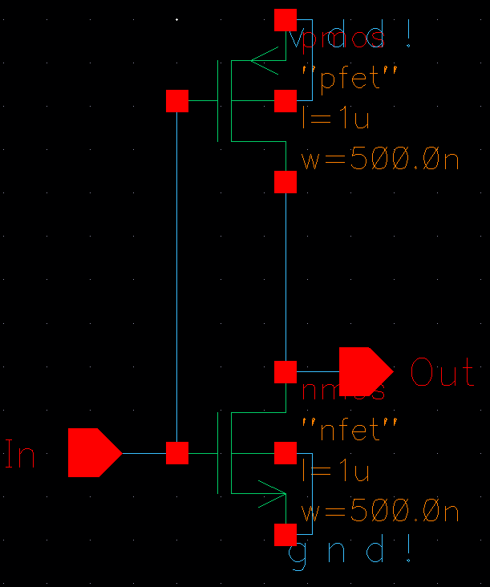
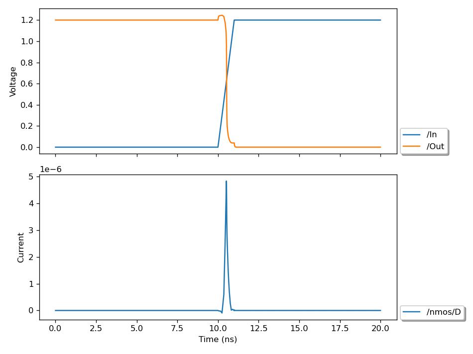
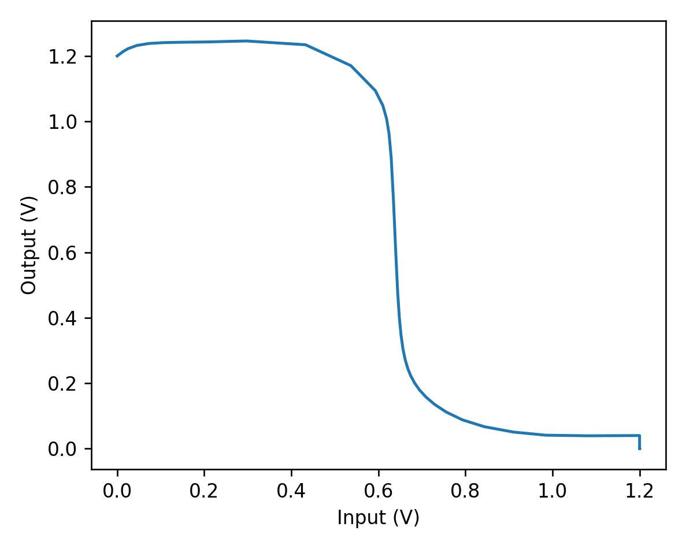

## Schematic Creation and Simulation

This example creates the following schematic of an inverter:

Then a simulation is run which results in the following plot:

A plot of the voltage transfer curve of the inverter is then made

