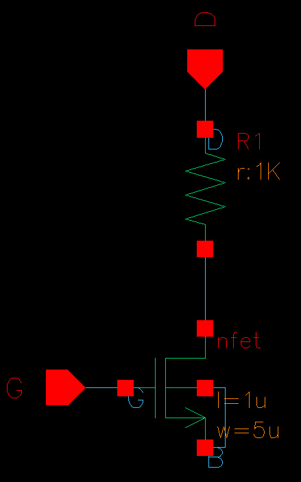

## **What is Virtuosopy?**

Virtuosopy is a Python interface to Cadence Virtuoso and uses the Python library SkillBridge. With Virtuosopy, schematics can be created and Spectre simulations can be run.

See Examples directory or **Usage** section below for more information.

## **Getting Started**
1. Install anaconda (link may be out of date). Go to anaconda.com and right click on the green Linux download button and copy link to get an updated link.

        cd ~/Downloads
        wget https://repo.anaconda.com/archive/Anaconda3-2022.10-Linux-x86_64.sh
        chmod +x ./Anaconda3-2022.05-Linux-x86_64.sh
        ./Anaconda3-2022.05-Linux-x86_64.sh

1. Restart shell
1. Disable activation of conda at startup

        conda config --set auto_activate_base false

1. Restart shell

1. Create a virtual environment 
        
        conda create -n vp_env

1. Activate the virtual environment called 'vp_env' and install python

        conda activate vp_env python

1. Install Virtuosopy

        cd src
        pip install --editable .

1. Start Virtuoso (in VNC session terminal) (Note: troubleshooting below)
        
        cd launch_scripts
        python ./launch_virtuoso_with_skillbridge.py <virtuoso_directory>

1. In the Virtuoso that opened, create a library called 'vp_demonstration'

1. Run the python example file or Open and run example notebook in the examples folder using your favorite notebook editor (I recommend VS Code with SSH)
        
        python ./Examples/01a_Schematics_and_Simulations.py

1. This will create a schematic you can open in the Virtuoso Library Manager

## **Usage**

### **Creating a schematic, placing instances, placing pins, and drawing wires:**
**1. Opening a schematic and placing an instace**
```python
# This creates (or overwrites if it exists) a schematic called example_circuit under the vp_demonstration library
# If overwrite=False and you try to create an instance that already exists you will get an error.
sch = vp.Schematic('vp_demonstration', 'example_circuit', overwrite=True)

# create a nmos and print its details
nmos = sch.create_instance('analogLib', 'nmos4', [0.,0.], 'nmos')

```
**2. Setting parameters and printing instance details**
```python
#  apply a width and length and print details
nmos['w'] = '5u'
nmos['l'] = '1u'
print(nfet)
```

        Instance Name:
                nmos
        Library Name:
                analogLib
        Cell Name:
                nmos4
        Pin Names: 
                B, D, G, S, 
        Parameter Names: 
                model, w, l, as, ad, ps, pd, nrd, nrs, ld, ls, m, trise, geo, rdc, rsc, sa, sb, sd, region, degradation, off, Vds, Vgs, Vbs, dtemp, 
        Applied Paramters: 
                w = 5u
                l = 1u


**3. Routing Wires**

```python
# connect the body to the source
sch.create_wire('route', [nmos.pins.S, nmos.pins.B], 'B')
```

**4. Quick Instance Placement**

Instances can be placed relative to the pins of other instances. Wires are routed automatically.

```python
# create a resistor above the nmos connected to the drain
R1 = sch.create_instance('analogLib', 'res', ([nmos.pins.D, 'MINUS'], 'above'), 'R1')
R1['r'] = '1k'
```

**5. Placing Pins**
```python
# connect pins to the loose ends
pin_G = sch.create_pin('G', 'input', (nmos.pins.G, 'left', 2))
pin_D = sch.create_pin('D', 'input', (R1.pins.PLUS, 'above', 2), 'R270')
```

**6. Saving**

CDF callbacks will be performed and paramters are double checked
```python
sch.save()
```



### **Running a Spectre Simulation**

#### See examples

## **Advanced Launch Options**

The python script for launching virtuoso with skillbridge can take arguments to launch multiple sessions of virtuoso. This can be usefull if you want to distribute many simulations for quick results. The first argument is the number of sessions with a GUI and the second argument is the number of sessions without a GUI. The total number of sessions is limited to 10 due to licensing constraints.

If you need to kill the sessions you can use kill_virtuosos_and_skillbridge. Note this will kill all Vituosos running under your account that have been run with the '-restore' flag!

If you launch multiple sessions, then when you are opening a schematic you need to provide the workspace ids that show up after running the launch script to each opened schematic.

## **Trouble Launching?**

### Manually Launch:

1. Launch Virtuoso like normal

1. In terminal with conda environment loaded:

        skillbridge path

1. type the load command shown from last step into Virtuoso CIW command window

1. launch skillbridge where netid is your netid, python_path is the result of the shell command 'which python':

        pyStartServer ?id "netid_0" ?python "LD_LIBRARY_PATH= {python_path}

1. copy cdf callback script to virtuoso directory

        cp ./launch_scripts/CCSinvokeCdfCallbacks.il <virtuoso_directory>

1. load cdf callback script:

        load("./CCSinvokeCdfCallbacks.il")


## **Known Issues**

### **CDF Instance Parameter Mismatch**
Currently when setting parameters for instances like the width of a transistor, 'wt', there can be unpredicable behavior. To help with this, when a save is performed the CDF callbacks are performed for each instance in the schematic. Then the user requested parameters are checked against the actual ones and if there is a difference Virtuosopy will warn the user. Also, as seen in the example setting 'wf' to a blank string helps produce predictable behabior.

### **Calling Redraw without a window open results in a error**

### **Extra Skillbridge servers running, if Virtuoso crashes**
Check if this is the case by running the list_running.py script. If there are extra sessions, run the kill_virtuosos_and_skillbridge.py script to kill these sessions.

### **Applied parameters will carry over from other schematics or instances**
This happens if a parameter for an instance is set, then another instance of the same component is created and that parameter is not set. For example if the width of an NMOS is set to 5u then another NMOS is created but no width is assigned, the width of the second NMOS will be 5u. To get around this, be sure to set all necessary parameters for every instance.

## **Troubleshooting**

### Instance name is not unique: 
Virtuoso requires unique names for all instances. If you are running a script multiple times, you need to set overwrite=True. (eg. sch = vp.Schematic('np_DPE', '3T_1R_DP_SB_sinking_rfebbo_test', overwrite=True)) This will erase the contents of the file you are opening. Use this with caution if there are aspects of the schematic not generated by the script.

### Simulation Debugging
Spectre can often run into issues which cause the simulation to fail. See the 'sim_output' directory under 'psf/spectre.out'

